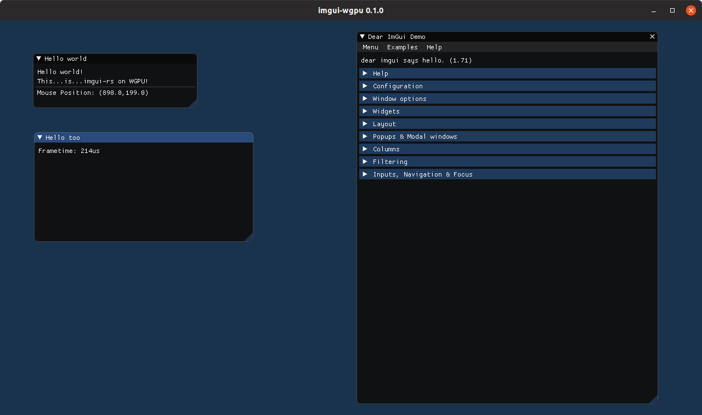

# dear imgui wgpu-rs renderer

Draw dear imgui UIs as a wgpu render pass. Based on [imgui-gfx-renderer](https://github.com/Gekkio/imgui-rs/tree/master/imgui-gfx-renderer) from [imgui-rs](https://github.com/Gekkio/imgui-rs).



# Usage

For usage, please have a look at the [example](examples/hello_world.rs).

# Example

Run the example with
```
cargo run --release --example hello_world --features [vulkan|metal|dx12]
```

# Status

Basic features are useable. Uses `wgpu-0.3.0` and `winit-0.20.0-alpha3` as well as `imgui-0.2.0` upstream.

Contributions are very welcome.
