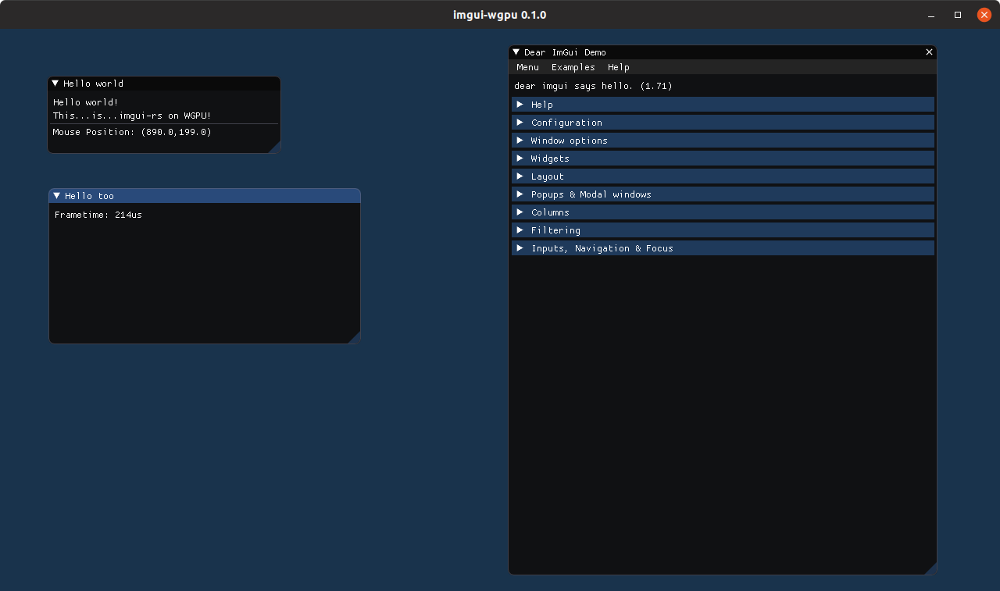

# dear imgui wgpu-rs renderer


[](https://docs.rs/imgui-wgpu)
[](https://crates.io/crates/imgui-wgpu)


Draw dear imgui UIs as a wgpu render pass. Based on [imgui-gfx-renderer](https://github.com/Gekkio/imgui-rs/tree/master/imgui-gfx-renderer) from [imgui-rs](https://github.com/Gekkio/imgui-rs).



# Usage

For usage, please have a look at the [example](examples/hello-world.rs).

# Example

Run the example with
```
cargo run --release --example hello-world
```

# Status

Contributions are very welcome.

# Version Compatibility

| imgui-wgpu | wgpu   | imgui |
|------------|--------|-------|
| master     | 27     | 0.12  |
| 0.25.0     | 25     | 0.12  |
| 0.24.0     | 0.17   | 0.11  |
| 0.23.0     | 0.16   | 0.11  |
| 0.22.0     | 0.15   | 0.10  |
| 0.21.0     | 0.14   | 0.9   |
| 0.20.0     | 0.13   | 0.8   |
| 0.19.0     | 0.12   | 0.8   |
| 0.18.0     | 0.11   | 0.8   |
| 0.17.0     | 0.10   | 0.8   |
| 0.16.0     | 0.9    | 0.7   |
| 0.15.0     | 0.8    | 0.7   |
| 0.14.0     | 0.7    | 0.7   |
| 0.13.0     | 0.7    | 0.6   |
| 0.12.0     | 0.6    | 0.6   |
| 0.11.0     | 0.6    | 0.5   |
| 0.10.0     | 0.6    | 0.5   |
| 0.9.0      | 0.6    | 0.4   |
| 0.8.0      | 0.5    | 0.4   |
| 0.7.0      | 0.5    | 0.4   |
| 0.6.0      | 0.5    | 0.3   |
| 0.5.0      | 0.4    | 0.3   |
| 0.4.0      | 0.4    | 0.2   |
| 0.1.0      | 0.3    | 0.2   |
